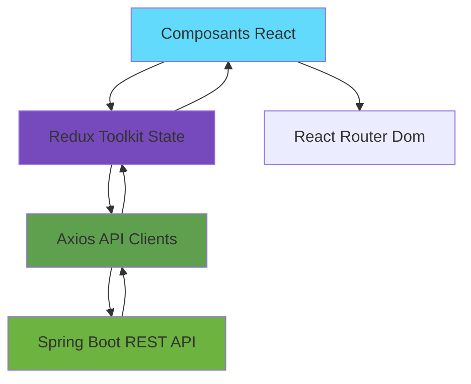

# 🛒 SmartShop – Frontend React

> Interface utilisateur moderne et réactive pour la gestion de boutique en ligne avec système de fidélité, catalogue produits et gestion des commandes.

[](https://react.dev/)
[](https://vitejs.dev/)
[](https://redux-toolkit.js.org/)
[](https://tailwindcss.com/)
[](https://opensource.org/licenses/MIT)

---

## 📋 Table des matières

- [À propos](#-à-propos)
- [Fonctionnalités](#-fonctionnalités)
- [Stack technique](#-stack-technique)
- [Architecture](#-architecture)
- [Installation](#-installation)
- [Scripts disponibles](#-scripts-disponibles)
- [Tests](#-tests)
- [Docker](#-docker)
- [Guide de démarrage](#-guide-de-démarrage)

---

## 🎯 À propos

**SmartShop Frontend** est une application React moderne développée pour offrir une expérience utilisateur fluide et intuitive pour la gestion d'une boutique en ligne. L'application propose :

- ✅ Interface admin complète pour la gestion des produits, clients et commandes
- ✅ Espace client personnalisé avec suivi des commandes
- ✅ Système d'authentification sécurisé par rôles
- ✅ Gestion du catalogue produits en temps réel
- ✅ Processus de commande optimisé avec codes promo
- ✅ Design responsive et moderne avec Tailwind CSS

---

## ✨ Fonctionnalités

### 🔐 Authentification & Autorisation

- **Login sécurisé** avec gestion de sessions (HttpOnly Cookies)
- **Contrôle d'accès basé sur les rôles** : `ADMIN` / `CLIENT`
- **Routes protégées** avec redirection automatique
- **Gestion de session** persistante

### 👥 Interface Admin

**Gestion des Clients :**
- Vue d'ensemble de tous les clients
- Création et modification de profils clients
- Consultation de l'historique des commandes
- Attribution de comptes utilisateur aux clients
- Statistiques de fidélité et dépenses

**Gestion des Produits :**
- CRUD complet des produits
- Gestion du stock en temps réel
- Catégorisation et recherche
- Upload d'images (future feature)

**Gestion des Commandes :**
- Création de commandes pour les clients
- Application de codes promotionnels
- Confirmation et annulation de commandes
- Suivi des paiements
- Historique complet

**Gestion des Paiements :**
- Création de paiements multiples par commande
- Types de paiement : Espèces, Carte, Chèque, Virement
- Encaissement et rejet de paiements
- Suivi du solde restant

### 👤 Interface Client

- **Profil détaillé** avec statistiques :
  - Niveau de fidélité actuel
  - Nombre total de commandes
  - Montant total dépensé
  - Historique complet
- **Mes commandes** avec détails et statuts
- **Suivi en temps réel** des paiements

---

## 🛠️ Stack technique

| Technologie | Version | Usage |
|------------|---------|-------|
| ⚛️ **React** | 19 | Library UI |
| ⚡ **Vite** | Latest | Build tool & dev server |
| 🔄 **Redux Toolkit** | Latest | State management |
| 🎨 **Tailwind CSS** | Latest | Styling & design system |
| 🛣️ **React Router** | v6 | Routing & navigation |
| 🌐 **Axios** | Latest | HTTP client |
| ✅ **React Hook Form** | Latest | Gestion des formulaires |
| 🧪 **Jest** | Latest | Tests unitaires |
| 🎭 **React Testing Library** | Latest | Tests de composants |
| 🌲 **Cypress** | Latest | Tests E2E |
| 🐳 **Docker** | Latest | Containerisation |
| 🚀 **Nginx** | Alpine | Serveur de production |

---

## 🏗️ Architecture

### Structure du projet
```
src/
│
├── 📱 components/          # Composants UI réutilisables
│   ├── common/            # Alert, LoadingSpinner, Badge
│   ├── layout/            # AppLayout, Navbar, Sidebar
│   └── features/          # ProductCard, ProductList, ProductFormModal
│
├── 📄 pages/              # Pages de l'application
│   ├── admin/             # Espace Administration
│   │   ├── AdminDashboardPage
│   │   ├── AdminProductsPage
│   │   ├── AdminClientsPage (ClientDetail)
│   │   └── AdminOrdersPage (OrderDetail)
│   └── client/            # Espace Client & Public
│       ├── HomePage (ProductsPage)
│       ├── LoginPage / RegisterPage
│       ├── CartPage
│       ├── MeOrdersPage
│       └── MeOrderDetailPage
│
├── 🔄 store/              # State Management (Redux Toolkit)
│   ├── slices/            # Slices Redux (Logic métier)
│   │   ├── authSlice.js
│   │   ├── cartSlice.js
│   │   ├── productSlice.js
│   │   └── orderSlice.js
│   └── store.js           # Configuration centrale du store
│
├── 🌐 services/           # API clients (Axios)
│   ├── apiClient.js       # Config Axios (Base URL, Interceptors)
│   ├── authService.js
│   ├── productService.js
│   ├── clientService.js
│   └── orderService.js
│
├── 🛣️ routes/             # Logique de navigation
│   ├── AppRoutes.jsx      # Toutes les routes
│   ├── PrivateRoute.jsx   # Protection Client
│   └── AdminRoute.jsx     # Protection Admin
│
├── 🪝 hooks/              # Hooks personnalisés
│   └── useCart.js
│
├── 🎨 styles/             # Styles globaux
│   ├── index.css
│   └── tailwind.css
│
└── 🔧 utils/              # Fonctions utilitaires partagées
    ├── formatters.js      # formatCurrency, formatDate
    ├── constants.js       # API_URL, REGEX
    └── validators.js      # Validation de formulaires
```

### Flux de données


**Principes architecturaux :**
- 🎯 **Separation of Concerns** : Composants, logique métier et state séparés
- 🔄 **Unidirectional Data Flow** : Redux pour un état prévisible
- 🧩 **Atomic Design** : Composants modulaires et réutilisables
- 🚀 **Code Splitting** : Lazy loading des routes pour optimiser les performances
- 🔒 **Route Guards** : Protection des routes par rôles

---

## 🚀 Installation

### Prérequis

- 📦 Node.js v20 ou supérieur
- 📦 npm v10 ou supérieur
- 🐳 Docker Desktop (optionnel, pour le déploiement)

### Étapes d'installation

**1. Cloner le repository**
```bash
git clone https://github.com/votre-repo/smartshop-frontend.git
cd smartshop-frontend
```

**2. Installer les dépendances**
```bash
npm install
```

**3. Configurer les variables d'environnement**

Créer un fichier `.env` à la racine :
```env
VITE_API_BASE_URL=http://localhost:8080
VITE_APP_NAME=SmartShop
```

**4. Lancer l'application en mode développement**
```bash
npm run dev
```

**5. Accéder à l'application**
```
🌐 http://localhost:5173
```

---

## 📜 Scripts disponibles

| Commande | Description |
|----------|-------------|
| `npm run dev` | Lance le serveur de développement Vite |
| `npm run build` | Génère le build de production optimisé |
| `npm run preview` | Prévisualise le build de production |
| `npm run lint` | Vérifie la qualité du code avec ESLint |
| `npm run lint:fix` | Corrige automatiquement les erreurs |
| `npm test` | Lance les tests unitaires avec Jest |
| `npm run test:watch` | Tests en mode watch |
| `npm run test:coverage` | Génère le rapport de couverture |
| `npm run cypress:open` | Ouvre l'interface Cypress (E2E) |
| `npm run cypress:run` | Lance les tests Cypress en headless |

---

## 🧪 Tests

### Tests Unitaires & Intégration

**Framework :** Jest + React Testing Library

**Localisation :** `src/**/*.test.js(x)`

**Lancer les tests :**
```bash
npm test
```

**Générer le rapport de couverture :**
```bash
npm run test:coverage
```

**Ouvrir le rapport :**
```bash
open coverage/lcov-report/index.html
```

### Tests End-to-End (E2E)

**Framework :** Cypress

**Localisation :** `cypress/e2e/`

**Mode interactif :**
```bash
npm run cypress:open
```

**Mode headless :**
```bash
npm run cypress:run
```

**Scénarios de test :**
- ✅ Login admin et client
- ✅ Création de produit
- ✅ Création de commande avec code promo
- ✅ Processus de paiement complet
- ✅ Navigation dans le profil client

---

## 🐳 Docker

L'application utilise une image Docker multi-stage optimisée avec Nginx pour la production.

### Dockerfile
```dockerfile
# Build stage
FROM node:20-alpine AS build
WORKDIR /app
COPY package*.json ./
RUN npm ci
COPY . .
RUN npm run build

# Production stage
FROM nginx:alpine
COPY --from=build /app/dist /usr/share/nginx/html
COPY nginx.conf /etc/nginx/conf.d/default.conf
EXPOSE 80
CMD ["nginx", "-g", "daemon off;"]
```

### Construction de l'image
```bash
docker build -t smartshop-frontend:latest .
```

### Lancement du container
```bash
docker run -d -p 8080:80 --name smartshop-ui smartshop-frontend:latest
```

### Accès à l'application
```
🌐 http://localhost:8080
```

---

## 🎮 Guide de démarrage rapide

### Scénario complet - Parcours Admin

**1. Se connecter en tant qu'Admin**

- URL : `http://localhost:5173/login`
- Identifiants :
  - Username : `admin`
  - Password : `admin123`

**2. Créer un produit**

- Navigation : Dashboard Admin → Produits → Nouveau Produit
- Remplir le formulaire :
  - Nom : "Laptop Dell XPS 15"
  - Description : "Ordinateur portable haute performance"
  - Prix unitaire : 1299.99
  - Stock : 10

**3. Créer un client**

- Navigation : Dashboard Admin → Clients → Nouveau Client
- Remplir le formulaire :
  - Nom : "Jean Dupont"
  - Email : "jean.dupont@email.com"
  - Téléphone : "+33612345678"
  - Adresse : "123 Rue de Paris, 75001 Paris"

**4. Créer un compte utilisateur pour le client**

- Depuis la page de détails du client
- Cliquer sur "Créer un compte"
- Username : `jean.dupont`
- Password : `Password123!`

**5. Créer une commande**

- Navigation : Dashboard Admin → Commandes → Nouvelle Commande
- Sélectionner le client : Jean Dupont
- Ajouter des produits
- Appliquer un code promo : `PROMO-NEW2024`
- Valider la commande

**6. Créer un paiement**

- Depuis les détails de la commande
- Cliquer sur "Ajouter un paiement"
- Montant : 500.00
- Type : Espèces
- Date : Aujourd'hui

### Scénario complet - Parcours Client

**1. Se connecter en tant que Client**

- URL : `http://localhost:5173/login`
- Identifiants :
  - Username : `jean.dupont`
  - Password : `Password123!`

**2. Consulter mon profil**

- Navigation automatique vers le tableau de bord client
- Visualisation :
  - Niveau de fidélité
  - Nombre total de commandes
  - Montant total dépensé
  - Dates de première et dernière commande

**3. Consulter mes commandes**

- Navigation : Mon Profil → Mes Commandes
- Voir les détails de chaque commande
- Vérifier les statuts et paiements

---

## 🚨 Gestion des erreurs

L'application gère les erreurs de manière centralisée avec des notifications utilisateur.

**Types d'erreurs gérées :**

| Code | Type | Affichage |
|------|------|-----------|
| `400` | Bad Request | Toast d'erreur avec détails de validation |
| `401` | Unauthorized | Redirection vers login |
| `403` | Forbidden | Message "Accès non autorisé" |
| `404` | Not Found | Page 404 personnalisée |
| `422` | Validation Error | Toast avec message métier |
| `500` | Server Error | Toast "Erreur serveur" |

**Exemple de gestion dans Axios :**
```javascript
axios.interceptors.response.use(
  response => response,
  error => {
    if (error.response?.status === 401) {
      store.dispatch(logout());
      window.location.href = '/login';
    }
    return Promise.reject(error);
  }
);
```

---

## 📡 API & Documentation

Le frontend communique avec le backend Spring Boot via Axios.

**Configuration :**
```javascript
// src/services/apiClient.js
const api = axios.create({
  baseURL: import.meta.env.VITE_API_BASE_URL,
  withCredentials: true, // Pour les cookies HttpOnly
  headers: {
    'Content-Type': 'application/json'
  }
});
```

**Documentation Postman :**
- Collection disponible dans `/docs/postman/`
- Import dans Postman pour tester les endpoints indépendamment

---

## ✅ Bonnes pratiques

- 🎯 **Atomic Design** : Composants découpés par responsabilité
- 🪝 **Custom Hooks** : Logique métier extraite et réutilisable
- 🔒 **Type Safety** : PropTypes pour la validation des props
- 📝 **Code Formatting** : Prettier + ESLint
- 🚫 **Zero Lint Errors** : Le linter doit passer avant chaque commit
- ♻️ **DRY Principle** : Éviter la duplication de code
- 📦 **Lazy Loading** : Routes chargées à la demande
- 🎨 **Design System** : Utilisation cohérente de Tailwind

---

## 👥 Auteur

- **Développée par** : Salma Hamdi

---

⭐ **Star ce projet si vous le trouvez utile !** ⭐